# 4月份到5月份 自适应滤波器 armadillo矩阵库
## vs 2017 配置 armadillo+ libopenblas
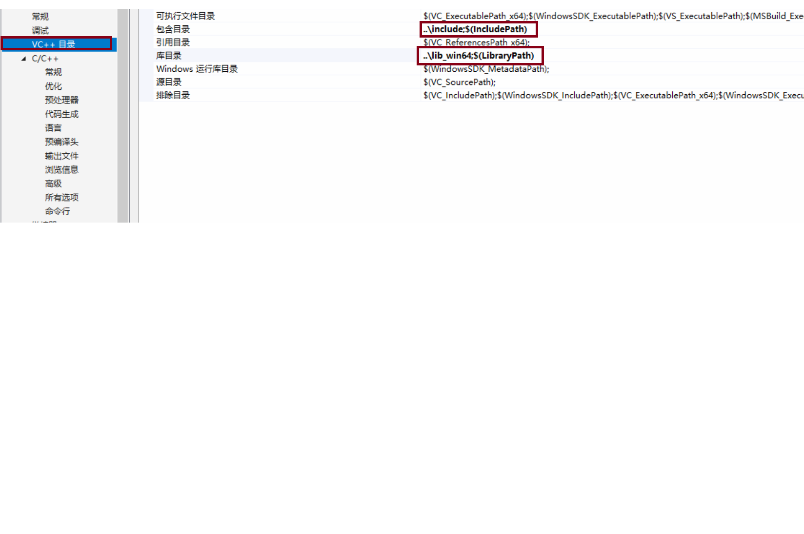


### 将.dll文件复制到项目文件.exe路径下
 [armadillo+ libopenblas 路径](file://arma/)
## armadillo 用法
```
1. 头文件：
   #include<armadillo>
   using namespace arma;
2. 矩阵定义和初始化：mat e, w;e.zeros(n, 1); 或者 mat M_e(m, 1,fill::zeros)
cx_mat xn(len, 1, fill::zeros); 复数矩阵  mat k(3, 1);K << 1.5 << 2.5 << 1;
3. 常用api：
dn(i, 0)  下标索引
dn % win 矩阵点乘
fft(A, n); 傅里叶变换，n为输出长度
spectral = abs(FFT);求分量的模
noise += spectral; 矩阵相加与赋值
noise = 0.25*noise; 矩阵与常数相乘
arg(FFT) 求复数角度
square(spectral) 分量平方
sum(A) 分量求和
sqrt(0.05 * spectral%spectral + 0.95 * noise %noise); 分量求根号
xn.set_real(noise%cos(ar));
xn.set_imag(noise%sin(ar)); 复矩阵实部和虚部赋值
ifft(xn) 逆傅里叶变化
real(ifft(xn)) 复矩阵取实部
yn.rows(0, 0.5 * len - 1)  矩阵分块操作
dn.n_rows 取行数
w.t() 转置
mat R = eye<mat>(m, m);生成单位矩阵
eig_gen(eigval, cor); 特征值与特征向量
diagmat(fft(xn.rows(k, M + k - 1))); 对角矩阵
flipud(A) 上下翻转
```
4. 参考文档：<br>
官方文档： [armadillo_joss_2016](file://arma/armadillo_joss_2016.pdf)
博客：[csdn](https://blog.csdn.net/yangkaikwill/article/details/45459915?locationNum=5)
5. armadillo+libopenblas优势是计算速度快（快于eigen），函数api简单，近似于matlab，缺点是体积大，配置麻烦
## 线性自适应滤波器原理：
1. 自适应滤波器的原理是通过迭代的方式减少滤波器的输出与参考音源之间的误差 ；一般来说包含两个过程：滤波阶段了自适应阶段，主要有两个分支最小均方（LMS）和RLS通常用于信号增强，lms因为它们非常简单且有效。 由于非常快的收敛速度和效率，递归最小二乘（RLS）算法在特定类型的应用中最受欢迎。
2. 横向滤波器：也称抽头演示线性滤波器或有限记忆脉冲响应滤波器，他由三个基本单位组成：单位延时单元，乘法器和加法器，如图所示：<br>
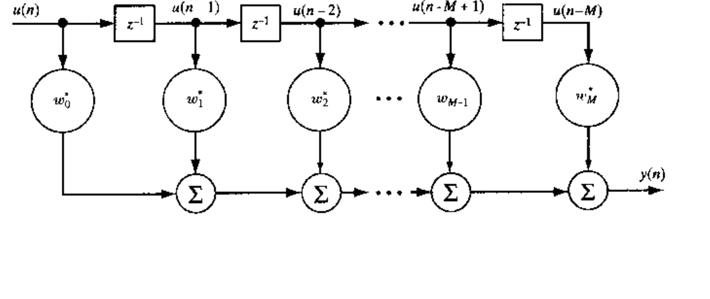
图中滤波结构的输出为：
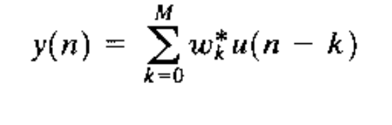
### LMS 自适应滤波器
LMS 采用梯度下降法，来优化滤波器的误差：
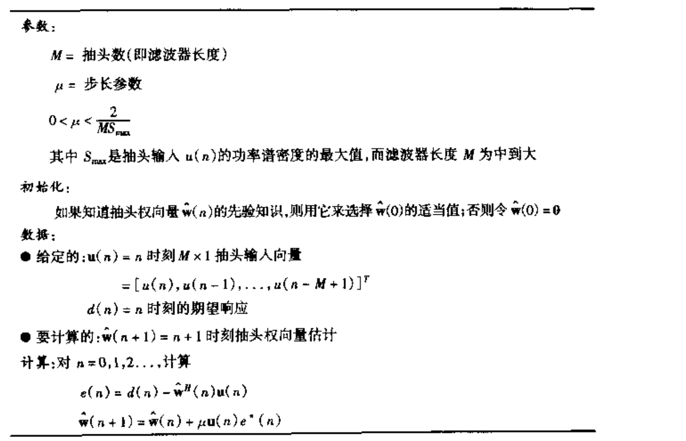

```C++
const mat  Filter::LMSfilter(const mat xn, const mat dn) {
	cout << "LMS" << endl;
	mat e, w;
	int n = dn.n_rows;
	int m = 1000;
	double u;
    u=0.05;
	cout << u << endl;
	e.zeros(n, 1);
	w.zeros(m, 1);
	for (int k = m; k < n; k++) {
		mat x = xn.rows((k - m), (k - 1));
		mat y = w.t()*(x);
		e.row(k - 1) = dn.row(k - 1) - y;
		w = w + x * u*e.row(k - 1);

	}
	 cout << "w=" << w(0, 0) << endl;
	mat yn;
	yn.zeros(n, 1);
	for (int k = m; k < n; k++) {
		mat x = xn.rows((k - m), (k - 1));
		yn.row(k - 1) =w.t()*(x);;

	}

	return  dn-yn;

}
```

LMS 有两个独特的特性：实现简答、模型独立；LMS滤波器主要的限制是他的收敛速度。影响LMS滤波器的两个主要的因素是：步长参数和抽头输入向量的相关矩阵的特征值而改变
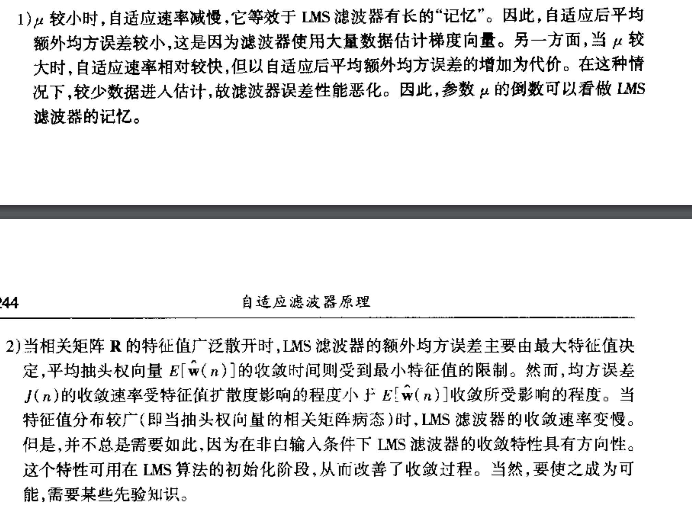
### RLS 自适应滤波器：
RLS 采用最小二乘法来减小误差
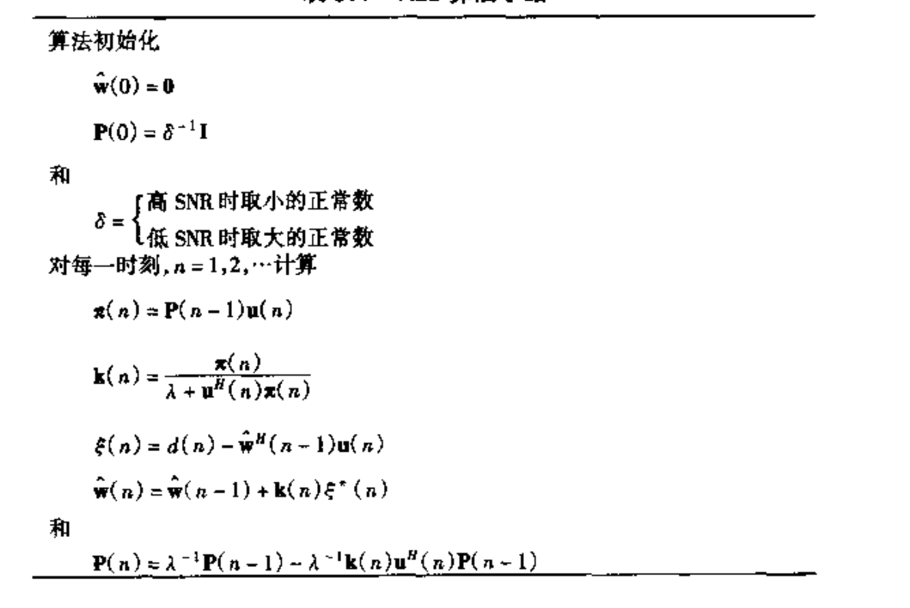
```C++
const mat Filter::RLSfilter(const mat xn, const mat dn) {
	cout << "RLS" << endl;
	mat e, w;
	int n = dn.n_rows;
	int m = 100;
	e.zeros(n, 1);//��������
	w.zeros(m, 1);//�˲���Ȩֵ����
	mat R = eye<mat>(m, m);
	for (int k = m; k < 15000; k++) {
		mat x = xn.rows(k - m, k - 1);
		mat y = w.t() * x;
		e.row(k - 1) = dn.row(k - 1) - y;
		mat rr = R * x*x.t()\*R;
		mat r = x.t()\*R\*x;
		for (int i = 0; i < m; i++)
			for (int j = 0; j < m; j++) {
				rr(i, j) = rr(i, j) / (1 + r(0, 0));
			}
		R = R - rr;
		w = w + R * x*e.row(k - 1);
	}
	mat yn;
	yn.zeros(n, 1);
	for (int k = m; k < n; k++) {
		mat x = xn.rows(k - m, k - 1);
		yn.row(k - 1) = w.t() * x;
	}
	return dn-yn;
}
```

RLS 算法与LMS算之间最大的区别是：LNS的步长因素被输入向量的相关矩阵的逆替代，因此RLs的收敛速度比LMS快一个数量级，同时RLS的性能不受输入向量的相关矩阵的特征值
# 五月份到六月份：频域上的降噪算法：
## 谱减法的基本原理
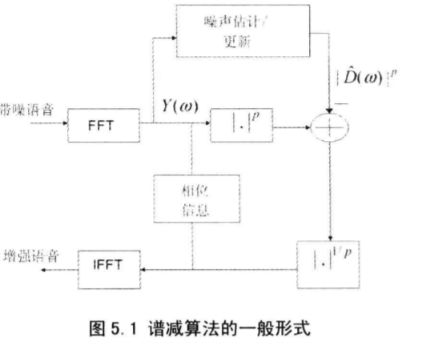
### 基本原理
1. 谱减法的基本原理是用带噪语音谱减去估计噪声谱后得到的频谱乘以一个增益来作为语音谱的估计
2. 基本假设：噪声是与语音不相关（频谱分量统计独立）的加性噪音,相位对语音可懂性没有影响，只是可能对语音质量产生非常小的影响，可以用带噪语音的相位替代去噪语音的相位
3. mmse谱减法与基本谱减法差别：1：mmse谱减将减完的谱乘以增益作为语音谱的估计，增益由mmse得到，基本谱减法没有乘以增益这一步。2.谱下界不一样。
4. 为了防止估计的噪声谱大于带噪语音谱，要设谱下界，谱下界应该要让去噪语音谱平滑
5. mmse 谱减法更新公式<br>
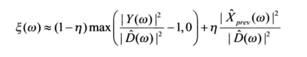
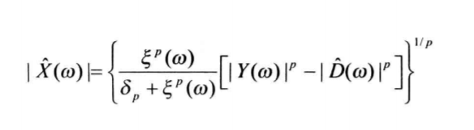
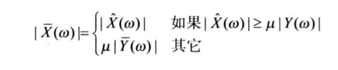
## mmse估计器和map估计器
### 基本原理
1. 将带噪语音谱乘上一个增益来计算纯净语音谱；
2. 与谱减法的差别：没有减去噪声谱的步骤；直接乘上增益  
### 官方文档： [降噪算法文档](file://paper/语音增强理论与实践 [（美）罗艾洲著；高毅等译] 2012年版.pdf)
### 代码内容
- class spectraldenoise 类是一个虚基类封装了频域上降噪的基本步骤。包含ola过程，噪声谱估计和更新，音频文件的读写，窗函数。
1. 噪声谱估计函数CalNoiseSpectral：
```C++
for (int k = 0; k < 4; k++) {
			for (int i = 0; i < len; i++) { in[i].r = data[k*len + i] * win[i]; in[i].i = 0; }
			kiss_fft(cfg, in, out);
			for (int i = 0; i < len; i++) {
				NoiseSpectral[i] += sqrt((out[i].r*out[i].r + out[i].i*out[i].i));
			}
		}
		for (int i = 0; i < len; i++) {
			NoiseSpectral[i] = NoiseSpectral[i] * 0.25;
			NoisePower += NoiseSpectral[i];
		}
	}
```
取语音的前四帧作为噪声谱的估计。
```C++
if ((Power / NoisePower) < threshold) {
			NoisePower = 0;
			for (int i = 0; i < len; i++) {
				NoiseSpectral[i] = (0.1* spectral[i] + 0.9*NoiseSpectral[i]);
				NoisePower += NoiseSpectral[i];
			}
		}
```
基于能量的噪声更新，并进行平滑处理，平滑系数为0.9

2. ola（overlap-add）
```C++
for (long long k = 0; k < length / len1; k++) {
		memmove(indata, indata + len1, len2 * sizeof(float));
		memmove(indata + len2, data + k * len1, len1 * sizeof(float));
    .....
  }
```
每次读取半帧。
```C++
for (int i = 0; i < len1; i++) {
			output[k*len1 + i] = out[i].r + old_out[i].r;
		}
		memmove(old_out, out + len1, len1 * sizeof(kiss_fft_cpx));
```
每次更新半帧，并前一帧的后半帧相加。

3. CalSpeechSpectral(float* Speech,const float*spectral)进行语音谱计算，是一个纯虚函数，需要实现频域上的降噪算法的时候，继承并实现功能就可以了。
4. #pragma once ：防止头文件多次载入
5. 纯虚函数声明
```c++
	virtual int CalSpeechSpectral(float* Speech,const float*spectral)=0;
```
6. 纯虚函数的定义（在子类中）
```c++
	int CalSpeechSpectral(float* Speech,const float*spectral)=0;
```
## linux上的文件夹操作
### 头文件：  
 #include <sstream\>  
 #include <fstream\>    
 #include <string\>    
 #include <unistd.h>  
 #include <dirent.h>  
 #include<vector\> <br>
 #include <sys/stat.h\>  
 #include<fcntl.h\>  
 #include<sys/types.h\>    
1. 分级新建文件夹
```C++
void mkdirs(const char *muldir)
{
    int i,len;
    char str[512];    
    strncpy(str, muldir, 512);
    len=strlen(str);
    for( i=0; i<len; i++ )
    {
        if( str[i]=='/' )
        {
            str[i] = '\0';
            if( access(str,0)!=0 )
            {
                mkdir( str, 0777 );
            }
            str[i]='/';
        }
    }
    if( len>0 && access(str,0)!=0 )
    {
        mkdir( str, 0777 );
    }
    return;
}
```
如果路径包含文件名也会新建一个同名的文件夹。
2. 分级读取文件
```C++
vector<string> getFiles(char* cate_dir)
{
	vector<string> files;//存放文件名
	DIR \*dir;
	struct dirent \*ptr;
	char base[1000];
	if((dir=opendir(cate_dir)) == NULL)
		{
		perror("Open dir error...");
			exit(1);
		}
	while ((ptr=readdir(dir)) != NULL){
		string str;
		str=ptr->d_name;
		struct stat buf;
		lstat(ptr->d_name,&buf);
		if(strcmp(ptr->d_name,".")==0 || strcmp(ptr->d_name,"..")==0)    ///current dir OR parrent dir
			{
				continue;}
		if(str.find(".wav")!=string::npos){
				string str1=cate_dir;
				//string str3="denoise_"+string(str1, 2,*(str1.end()-1));
				//mkdirs(str3.data());
				string str2=ptr->d_name;
				str2=str1+'/'+str2;
				files.push_back(str2);
			}
		else if(S_ISDIR(buf.st_mode))
		{	std::vector<string> src;
			memset(base,'\0',sizeof(base));
			strcpy(base,cate_dir);
			strcat(base,"/");
			strcat(base,ptr->d_name);
			src=(getFiles(base));
			files.insert(files.end(), src.begin(), src.end());
		}
	}
	closedir(dir);
	return files;
}
```
在很多情况下readdir就可以完成分级读取文件名的工作，但在文件系统为xfs等情况下，readdir返回的文件类型（d_type可能为空），所以考虑到兼容性还是用stat比较好，但是stat有可能把所有的路径都判断为目录（fstat则会把所有的目录都判断成文件），所以像上面那样写可能更好。
### C++分行读取txt
```C++
ifstream  fin("filename.txt", ios::in);
	char  line[1024] = { 0 };
	while(fin.getline(line, sizeof(line))){
		stringstream  word(line);
		word >> in;
```
### c 内存操作
```C++
float*PrevSpeech = (float *)malloc(2 * len * sizeof(float)); //申请动态空间
free(PrevSpeech) (PrevSpeech=null) //释放指针，必须和malloc一起使用
#include<string.h>
memset(PrevSpeech, 0, 2 * len * sizeof(float)); //将PrevSpeech 2 * len * sizeof(float) 个内存空间都设置为零
memmove(PrevSpeech, PrevSpeech + len, len * sizeof(float)); // 将PrevSpeech + len 指向的地址后面len * sizeof(float) 复制到PrevSpeech 指向的地址后面
```
### ctime时间计算
```C++
double time=0;
clock_t startTime, endTime;
startTime = clock();
endTime = clock();//计时结束
time += (double)(endTime - startTime) / CLOCKS_PER_SEC;
```
### ctime记时不准原因分析：
- clock函数的实现是基于时钟计时单元的。问题就出在了cpu的时钟计时单元上。当采用多核cpu时，进程或线程调用clock，记录了当前核时钟。但在下次调用clock之前很可能发生cpu调度，进程或线程被调度到其他cpu上运行。这导致两次取得计时单元并不是同一个cpu的，产生计时错误
- clock函数并没有考虑CPU被子进程消耗的时间
- Real指的是实际经过的时间，User和Sys指的是该进程使用的CPU时间。Real是墙上时间(wall clock time)，也就是进程从开始到结束所用的实际时间。这个时间包括其他进程使用的时间片和进程阻塞的时间（比如等待I/O完成）。 User指进程执行用户态代码（核心之外）所使用的时间。这是执行此进程所消耗的实际CPU时间，其他进程和此进程阻塞的时间并不包括在内。 Sys指进程在内核态消耗的CPU时间，即在内核执行系统调用所使用的CPU时间。
那么，什么情况下进程开始到结束所经过的时间会比进程所消耗的用户时间和系统时间(user time + sys time)小呢？
User+Sys为进程所使用的实际CPU时间。在多处理器的系统上，一个进程如果有多个线程或者有多个子进程并行执行，就可能导致Real time比CPU time（User + Sys time）要小，这是很容易理解的
### C++ 异常处理
```C++
try {
		}
		catch (...) {
		}//接收所有类型的异常
```
### kiss_fft 库的使用
```C++
#include"kiss_fft.h"
#include"_kiss_fft_guts.h"
cfg = kiss_fft_alloc(nfft, 0, 0, 0);//正变化
icfg = kiss_fft_alloc(nfft, 1, NULL, NULL);//逆变化
kiss_fft_cpx* in = (kiss_fft_cpx *)malloc(len * sizeof(kiss_fft_cpx));
kiss_fft_cpx* out = (kiss_fft_cpx *)malloc(nfft * sizeof(kiss_fft_cpx));
for (int i = 0; i < nfft; i++) { in[i].r = data[k*len + i] * win[i]; in[i].i = 0; } //赋值
kiss_fft(cfg, in, out);
free(cfg);
free(icfg);
delete[] in;
delete[] out;
```
### [kiss_fft githup 地址](https://github.com/berndporr/kiss-fft)
### math.h 中的三角函数
```C++
double sin(double);//正弦 参数为弧度（π）， 下同
double cos(double);//余弦
double tan(double);//正切
//2. 反三角函数
double asin (double); //反正弦 结果介于[-PI/2,PI/2]
double acos (double); //反余弦 结果介于[0,PI]
double atan (double c); //反正切（主值），结果介于[-PI/2,PI/2]
double atan2 (double a,double,b); //反正切（整圆值），结果介于[-PI,PI],c=a/b
//3. 双曲三角函数
double sinh (double);
double cosh (double);
double tanh (double);
/*
————————————————
版权声明：本文为CSDN博主「李维斯Lee」的原创文章，遵循 CC 4.0 BY-SA 版权协议，转载请附上原文出处链接及本声明。
原文链接：https://blog.csdn.net/sdscscs22/article/details/54649268*/
```
### mmse谱减法语音谱计算代码
```C++
int ss::CalSpeechSpectral(float* Speech, const float*spectral) {
	for (int w = 0; w < nfft; w++) {
		double psnr = spectral[w] * spectral[w] / NoiseSpectral[w] * NoiseSpectral[w];
		double prev_snr = PrevSpeech[w] * PrevSpeech[w] / NoiseSpectral[w] * NoiseSpectral[w];
		prev_snr = (prev_snr < log(3)) ? psnr : 30;
		double ou = (1 - 0.96)*((psnr > 1) ? (psnr - 1) : 0) + 0.96 * prev_snr;
		double temp1 = sqrt((ou*ou / (ou*ou + 0.5))*(spectral[w] * spectral[w] - NoiseSpectral[w] * NoiseSpectral[w]));
		double temp2 = 0.5*(0.2*(spectral[w]) + (PrevSpeech[w]));
		Speech[w] = (temp1 > 0.2*(spectral[w])) ? temp1 : temp2;
	}
	cout << 1 << endl;
	memmove(PrevSpeech, PrevSpeech + nfft, nfft * sizeof(float));
	memmove(PrevSpeech + nfft, Speech, nfft * sizeof(float));
	return 1;
}
```
### logmmse 计算语音谱代码
```C++
int logmmse::CalSpeechSpectral(float* Speech, const float*spectral) {
	float aa = 0.98;
	float ksi_min = pow(10, -2.5);
	for (int w = 0; w < nfft; w++) {
		double psnr = spectral[w] * spectral[w] / NoiseSpectral[w] * NoiseSpectral[w];
		psnr = (psnr < 40)?psnr:40;
		double prev_snr = PrevSpeech[w] * PrevSpeech[w] / NoiseSpectral[w] * NoiseSpectral[w];
		double snr = aa * prev_snr + (1 - aa)*((psnr - 1 > 0) ? (psnr - 1) : 0);
		double A = snr/ (1 + snr);
		double  vk = A * psnr;
		double ei_vk = 0.5 * (-expp(vk));
		double hw = A * exp(ei_vk);
		Speech[w] = spectral[w] * hw;
	}
	memmove(PrevSpeech, PrevSpeech + nfft, nfft * sizeof(float));
	memmove(PrevSpeech + nfft, Speech, nfft * sizeof(float));
	return 1;
}
```
### c++ 计算如下积分：
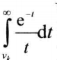
```C++
double logmmse::expp(double x)
{
	int m, i, j;
	double s, p, ep, h, aa, bb, w, xx, g, r, q;
	static double t[5] = { -0.9061798459,-0.5384693101,0.0,
						 0.5384693101,0.9061798459 };
	static double c[5] = { 0.2369268851,0.4786286705,0.5688888889,
						0.4786286705,0.2369268851 };
	m = 1;
	if (x == 0) x = 1.0e-10;
	if (x < 0.0) x = -x;
	r = 0.57721566490153286060651;
	q = r + log(x);
	h = x; s = fabs(0.0001*h);
	p = 1.0e+35; ep = 0.000001; g = 0.0;
	while ((ep >= 0.0000001) && (fabs(h) > s))
	{
		g = 0.0;
		for (i = 1; i <= m; i++)
		{
			aa = (i - 1.0)*h; bb = i * h;
			w = 0.0;
			for (j = 0; j <= 4; j++)
			{
				xx = ((bb - aa)*t[j] + (bb + aa)) / 2.0;
				w = w + (exp(-xx) - 1.0) / xx * c[j];
			}
			g = g + w;
		}
		g = g * h / 2.0;
		ep = fabs(g - p) / (1.0 + fabs(g));
		p = g; m = m + 1; h = x / m;
	}
	g = q + g;
	return(-g);
}
```
# 工信部比赛：socket protobuf和c++11的多线程
### socket 服务端流程：
```C++
#include <sys/types.h>
#include <sys/socket.h>
const int QLEN=10;
int listenfd;
struct sockaddr_in seraddr;
struct sockaddr_in clinet_addr;
socklen_t len=sizeof(sockaddr);
for(int i = 0 ; i < 3;++i)
  {
      if((listenfd = socket(AF_INET,SOCK_STREAM,0)) > 0)
      {
          cout<<"create socket success..."<<endl;
          break;
      }
  }
    seraddr.sin_family = AF_INET ;//AF_INET（TCP/IP – IPv4）
    seraddr.sin_port =  htons(atoi(port));//接口
    seraddr.sin_addr.s_addr = htonl(INADDR_ANY);//NADDR_ANY转换过来就是0.0.0.0，泛指本机的意思，也就是表示本机的所有IP
    if(bind(listenfd,(struct sockaddr *)&seraddr, sizeof(seraddr)) < 0)
    {
        cout<<"bind address with socket failed..."<<endl;
        close(listenfd);
        return -1;
}
       if(listen(listenfd,QLEN) == -1)
    {
        cout<<"listen on socket failed..."<<endl;
        close(listenfd);
        return -1;
    }
    if( (connfd = accept(listenfd,(struct sockaddr*)&seraddr,&len)) < 0 )
   {
       cout<<"accept the request failed"<<endl;
       close(listenfd);
       return -1;
   }
   if((recv1=recv(connfd,buff1,sizeof(buff1),0))!=BUFFSIZE)
   int sendd= send(connfd,buff,TBNR.ByteSizeLong(),0);
```
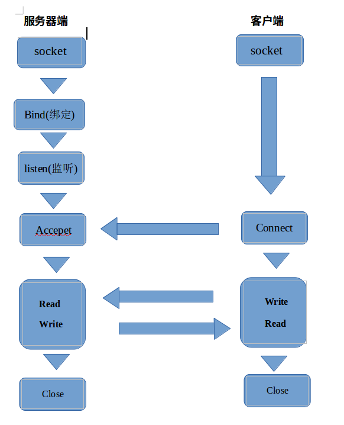

### [socket 教程](https://www.cnblogs.com/kefeiGame/p/7246942.html)
### protobuf 初入门
```C++
TaskHeader th;
th.ParseFromArray(buff1,BUFFSIZE);//解析消息
th.tasklength()//消息体里的字段
SpkResultList TBNR;
SpkResult* trhr =TBNR->add_resultlist();//嵌套消息
trhr->set_audioid(ai.audioinfo(i+t).audioid());//设置消息体字段
TBNR.SerializeToArray(buff,TBNR.ByteSizeLong());
```
### C++11 多线程初入门
```C++
#include <thread>
thread task(sr,vp_node,ai,&TBNR,i,&ru,jj);// sr：多线程调用的函数名，vp_node,ai,&TBNR,i,&ru,jj：函数参数传递
task.detach();//decach或join
```
### C++11 锁初入门
```C++
#include <mutex>
mutex m;
m.lock();
m.unlock();
```
### linux signal 处理
```C++
#include<signal.h>
void pipehandle(int temp){
signal(SIGPIPE,pipehandle);
}//不终止程序
signal(SIGPIPE,pipehandle);//客户端程序向服务器端程序发送了消息，然后关闭客户端，服务器端返回消息的时候就会收到内核给的SIGPIPE信号,pipehandle 自定义处理方式
```
### signal 几个要点：
1. 写在会出现异常的前面

### sstream 类型转换int to string
```C++
#include <sstream>
int connfd=1;
stringstream ss;
ss<<connfd;
string st=ss.str();
```
### c 语音中的转换
```c
#include<stdio.h>
int a=1;
char aa[100];
sprintf(aa,"%d",a);
```
### fstream 中的文件操作
```C++
#include<fstream>
ofstream output1(logname, ios::out | ios::binary |ios::app);//logname:打开的文件名， ios::out | ios::binary |ios::app：  以输出方式打开文件|以追加方式打开文件|以二进制方式打开文件
output1<<error<<endl;
output1.close();
```
更多文件打开方式

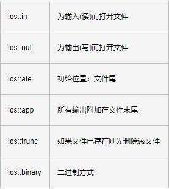
### map的使用
```C++
#include<map>
map<string,map<float,string>>results;
results[spkid].insert(pair<float,string>(info.scores[ii].score,ai.audioinfo(i+t).audioid()));//map嵌套map
map<string,map<float,string>>::iterator it;
map<float,string>::reverse_iterator itt;
for(it=results.begin(); it!=results.end(); it++){
for(itt=it->second.rbegin();itt!=it->second.rend();itt++){
}//map 会根据key值进行自动排序
  }
```
## git 使用
#### 生成ssh
- window 下载git bash可以比较方便
- 修改port 	vim  ~/.ssh/config 添加 port ****（如果有需要）
- ssh-keygen -t rsa -C jackluo@xxxx.com  邮箱看gitlab的账号
- 	将~/.ssh/id_rsa.pub复制到gitlab-setting-sshkey

### clone
- git clone -b 分支名 -o 远程主机名 git@v***************.git

### 更新远程库库的基本步骤
- 修改clone到本地的库（增删改）
- git add -A   将目录里的所有文件提交到暂存区后（git add -u git add git add \*）
- git commit -m "更新说明"
- git push <远程主机名> <本地分支名>:<远程分支名>
### 更新本地库
-git pull <远程主机名> <远程分支名>:<本地分支名>
### 强制覆盖本地库
-  git fetch --all  
-   git reset --hard origin/master  (覆盖到本地的分支)<br>
-   git pull<br>
[git 教程](http://www.ruanyifeng.com/blog/2014/06/git_remote.html)
## 北京期间其他工作总结：
python批量修改文件下文件名
```python
import os
import sys
if __name__=='__main__':
	for root, dirs, files in os.walk(sys.argv[1]):
		for name in files:
			filename=os.path.join(root, name).replace("\\","/")
			filename1=os.path.join(root, name).replace("&","_")
			os.rename(filename,filename1)
```
python批量提取文件下文件名到文本中
```python
import os
import sys
if __name__=='__main__':
	f = open(sys.argv[2],'w')
	for root, dirs, files in os.walk(sys.argv[1]):
		for name in files:
			filename=os.path.join(root, name).replace("\\","/")
			print(filename)
			f.write(filename)
			f.write('\n')
```
python 下删除文件下所有文件
```python
import os
import sys
if __name__=='__main__':
	for root, dirs, files in os.walk(sys.argv[1]):
		for name in files:
			filename=os.path.join(root, name).replace("\\","/")
			os.remove(filename)
```
### ffmpeg
```
ffmpeg  -acodec pcm_alaw -f s16le -ar 8000 -ac 1 -i in.wav out.wav    #音频格式转化
ffmpeg -f concat  -i list.txt -c copy all.mp3   #音频拼接
ffmpeg -i audio.wav -save 0 -f segment -segment_time 60 -c copy audio%02d.wav 音频分割，已秒为单位
list.txt 格式：
file '1.wav'
file '2.wav'
```
